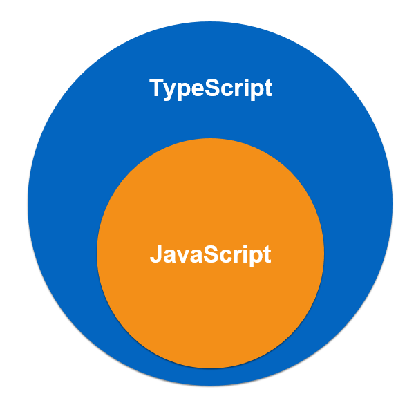

# TypeScript


## Introduction

### TypeScript, kezako ?

TypeScript est un surensemble de JavaScript ainsi qu'un compilateur.




À mis chemin entre un langage et un outils.

TS utilise sa propre syntaxe (comme un langage basé sur JS) et proche de celle de Java sans pour autant trop s'éloigné de JS. Il ne requiert pas de bibliothèque comme les autres langages découlant de JS, il a juste besoin de NodeJS pour fonctionner. Et finalement, une fois le développement terminer TS n'a plus d'intérêt (le côté outils).

L'intérêt avec TS c'est de pouvoir utiliser plus aisément certaines choses que JS permet, mais de façon complexe, j'y reviendrais plus tard. Un autre avantage de TS c'est la sécurité lors du développement. Pour l'exemple, il permet de préciser ce qui sera placer dans une variable (bien qu'optionnel) afin que par après, si on tente d'y mettre un autre type de donnée, TS nous avertis par une erreur.

### Quels sont les avantages ?

- Il permet une programmation orienté objet basé sur les classes (encapsulation, héritage, etc ... du coup adieu les prototype JS).
- Il offre une sécurité lors du développement.
- S'intègre parfaitement avec n'importe quel langage basé sur JS.
- Laisse un code propre en cas d'arrêt du projet (utilisation TS ou du projet en lui même).
- Contient les fonctionnalité de l'ES6.

### Comment l'installer ?

__**NodeJS**__

Linux :
```
sudo apt-get update
sudo apt-get install nodejs npm
```

Windows/Mac :
```
https://nodejs.org/en/download/
```

__**TypeScript**__

Linux/Windows/Mac :
```
npm install -g typescript
tsc -v
```


### Les Changements

Où les changements ce font par rapport à JS ?

Dans l'utilisation des strings, des nombres, des booléens, des arrays, du type "any", le void ainsi que le null (même s'ils sont pour ainsi dire identique à JS), les tuples (liste), les fonctions, les interfaces et les classes.


### Les bases

Créons un fichier de base avec un code ... de base.

```
let test: string = 'Hello World';
console.log(test);
```

Et complions-le pour voir ce que ça donne, pour ce faire ouvrez votre terminal dans le dossier ou ce trouve votre projet avec la commande :
```
tsc monfichierjs.ts
```

Et si le fait de devoir recomplier à chaque vous ennuie entrez la commande : 
```
tsc monfichierjs.ts -w
```
Ceci activera le mode "watch" qui compilera le fichier à chaque sauvegarde (idéale pour les petit projet, mais utiliser avec modération sur des projet plus gros, je vous laisse réfléchir au pourquoi).

Continuons.

Nous pouvons constater que le code est passé de ceci :
```
let test: string = 'Hello World';
console.log(test);
```
A cela :
```
var test = 'Hello World';
console.log(test);
```

Hmmm, pas très convainquant ... Nous avons écrit plus de ligne pour pas grand chose ... Et aussi pourquoi le "let" est devenu "var" ?

Hé bien même si le code est plus long, ça permet d'éviter les bugs et rend le débogage plus simple, de plus si vous préférer ne pas déclarer le type de la variable, vous n'êtes pas obligé TS sais le faire tout seul comme un grand. Mais c'est plus sémantique de le faire. Ensuite pour le let, il ne faut pas oublier que par exemple si un "let" est déclaré dans un "if" il ne pourra pas être appelé en dehors, quant au "var" cela dépendra de la situation. S'il est déclarer dans une fonction, il pourra être appelé dans n'importe qu'elle fonction, mais pas ailleurs, tandis que s'il est déclarer en dehors alors sa portée sera globale.

### Le type any
Celui-ci permet de faire comprendre à TS que la variable peux accueillir n'importe quoi.

### Le type array

Alors, si TS détecte si un type n'est pas correcte, comment faire dans le cas d'un array avec plusieurs type dedans ?

Essayons ceci alors :

```
let array: (string | number)[] = ['Brandon', 'Alizée', 'Kameron', '20', '19', '17'];
```

Et voila un array uniquement composer de caractères et de nombre. Si vous désirez le même, mais avec un seul type de variable en voici un exemple :

```
let array: number[] = ['24', '25', '26'];
```

### Le type tuple

```
let tuple: [string, number] = ['Brandon', 10];
```

Ceci permet de créer une liste où le premier élément doit obligatoirement être une chaine de caractère et le second éléments être un number sous peine d'avoir une erreur.

### Le type classe

La nous allons entré dans la programmation orienté objet (celle proche de Java).

```
class Utilisateur {
  nom:string;
  email:string;
  age:number;
  ville?:string;
  pays="Belgique";
  ...hobbies;
  
  constructor(nom: string, email: string, age: number) {
    this.nom = nom;
    this.email = email;
    this.age = age;
    
    console.log("Voici un nouvel utilisateur" + this.nom);
  }
}

let nouveau = new Utilisateur('Brandon', 'brandondu86yoloswag2013@live.fr', 20);
```

Après compilation, la différence de code est déjà plus flagrante, en TypeScript, le code est déjà plus clair. En voyant la différence créer une classe en TS est une chose plus aisée que en JS pur.

## Conclusion

TypeScript est un outils puissant qui peux s'avérer assez utile (Bertrand pourra vous le confirmer). Il est aussi assez utile pour faire la transition entre JavaScript et les autres frameworks de celui-ci.
